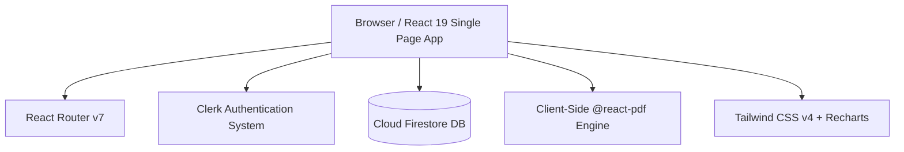

# 03. Tech Stack & Architecture Document

---

## 1. Technology Breakdown



### Core Technologies
* **Frontend Framework:** React 19 (`react`, `react-dom`)
* **Build System:** Vite 8 (`@vitejs/plugin-react-swc`)
* **Styling Engine:** Tailwind CSS v4 (`@tailwindcss/vite`) via `@import "tailwindcss"` in `src/index.css`
* **Authentication Engine:** Clerk React SDK (`@clerk/react`) — Single Sign-On, Google Auth, Passwordless, & Session Tokens
* **Database & Storage:** Firebase v12 Cloud Firestore (`firebase/app`, `firebase/firestore`)

* **Routing:** React Router v7 (`react-router-dom`)
* **Document Export:** `@react-pdf/renderer` v4 & `@ag-media/react-pdf-table`
* **Data Visualization:** Recharts v3
* **Notifications:** `react-hot-toast`
* **UI Icons:** `react-icons`

---

## 2. Architectural Design Patterns

### A. Modular Layered Architecture
* **View Layer (`src/pages/`, `src/components/`):** Presentation components responsible for UI rendering, event handling, and user feedback.
* **Service Layer (`src/firebase/`):** Pure asynchronous SDK functions that execute Firebase CRUD operations. Encapsulates raw Firestore calls away from React components.
* **Context Layer (`src/contexts/`):** Holds global session state (Authenticated user profile, active user ID, auth loading state).

### B. Firestore Query Pattern
All read operations follow the tenant-isolation query pattern:
```javascript
import { collection, query, where, getDocs } from "firebase/firestore";
import { db } from "./firebaseConfig";

export const getUserInvoices = async (userId) => {
  const q = query(collection(db, "invoices"), where("userId", "==", userId));
  const querySnapshot = await getDocs(q);
  return querySnapshot.docs.map(doc => ({ id: doc.id, ...doc.data() }));
};
```

---

## 3. Rationale for Tech Choices
* **Why React 19 + Vite?** Ultra-fast HMR dev server, zero-bundle overhead build pipeline, and compatibility with modern React features.
* **Why Tailwind CSS v4?** Native CSS theme variables, zero JS runtime overhead, fast styling without heavy external libraries.
* **Why `@react-pdf/renderer`?** Renders PDF documents directly in the client browser using React components, eliminating backend PDF server hosting costs.
* **Why Firebase Firestore?** Real-time data synchronization, multi-tenant security rules out of the box, and seamless scaling.
