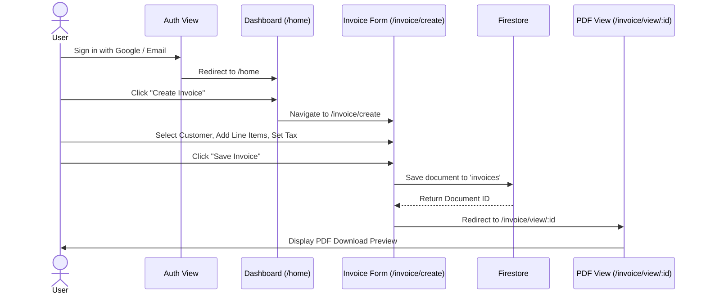

# 10. UI/UX Screen Flows & Wireframe Specs

---

## 1. Primary User Journey Flows

### Flow A: New User Onboarding & Invoice Creation

---

## 2. Screen Layout Specs

### Screen 1: Dashboard (`/home`)
* **Header:** Welcome greeting, quick action button ("+ Create Invoice").
* **Top Grid (4 Cards):** Total Revenue, Paid Invoices, Pending Invoices, Overdue Invoices.
* **Middle Section:** 
  * Left: Recharts Monthly Revenue Trend (Line/Bar Chart).
  * Right: Invoice Status Distribution (Pie Chart).
* **Bottom Section:** Recent Invoices Table (Top 5 items with quick status update trigger).

### Screen 2: Invoice Management (`/invoice`)
* **Top Header:** Title, Search Bar, Status Filter Dropdown (`All`, `Paid`, `Pending`, `Overdue`).
* **Main Table:** Desktop view renders clean table; Mobile view renders responsive card stack.
* **Row Actions:** View PDF, Edit, Update Status, Delete.
