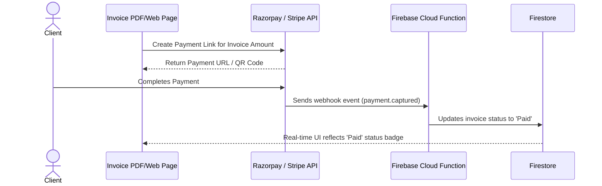

# 18. Payment Gateway Integration Specification

---

## 1. Overview
Integrate **Razorpay** (India / INR) and **Stripe** (International / USD) to allow clients to pay invoices directly via a dynamic link embedded on the web view and PDF invoice.

---

## 2. Integration Architecture

---

## 3. Webhook Handling Rules
* **Signature Verification:** All incoming webhooks must verify `x-razorpay-signature` or Stripe signature using server secret.
* **Idempotency:** Webhook processor checks if `invoice.status === 'Paid'` before processing to prevent duplicate status updates.
