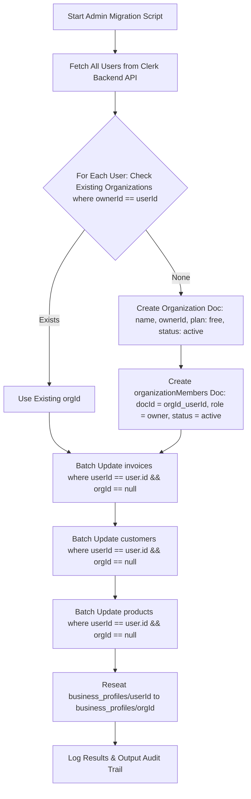
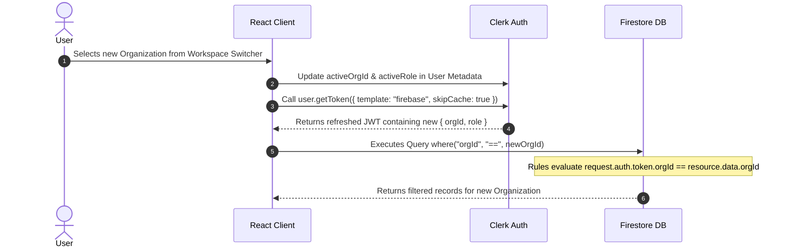

# B2B Migration Step 1: Ownership Model & Tenant Architecture Specification

---

## 🎯 Executive Overview
This document defines the architectural specification for **Step 1 of the B2B Migration**: transitioning from single-user (`userId`) data isolation to **Multi-Tenant Organization-Scoped Ownership (`orgId`)**.

### Non-Negotiable Invariants:
1. **Separation of Tenant & Role:** The `role` string (`"owner"`, `"admin"`, `"accountant"`, `"viewer"`) is stored **strictly on `organizationMembers` records**, NEVER on individual domain documents (`invoices`, `customers`, `products`).
2. **Zero-Read Custom Claims Security Rules:** Firestore Security Rules rely entirely on **Clerk JWT Custom Claims** (`request.auth.token.orgId` and `request.auth.token.role`), eliminating dynamic `get()` / `exists()` lookups against `organizationMembers` on standard document requests.
3. **Dual-Key Stamping:** Every domain document carries `orgId` (the multi-tenant isolation key) and `userId` / `createdBy` (for creator tracking, user-level lookups, and audit).
4. **Deterministic Business Profile:** The `business_profiles` document ID matches `orgId` (`doc(db, "business_profiles", orgId)`).
5. **Server-Side Idempotent Migration:** Zero client-side lazy document mutations; historical data is migrated via a dedicated Node.js Firebase Admin script.

---

## 🗄️ 1. Final Firestore Collection Schemas

```
firestore-root
 ├── organizations/                 # Organization metadata, tier, and trial
 │    └── {orgId}
 ├── organizationMembers/           # Organization team roster & roles
 │    └── {orgId}_{userId}
 ├── business_profiles/             # Organization legal & billing identity
 │    └── {orgId}
 ├── invoices/                      # Org-scoped issued invoices
 │    └── {invoiceId}
 ├── customers/                     # Org-scoped client directory
 │    └── {customerId}
 └── products/                      # Org-scoped inventory & catalog
      └── {productId}
```

---

### A. `organizations` (New Root Collection)
Stores organization metadata, subscription plan tier, and workspace ownership.

| Field Name | Type | Description |
| :--- | :--- | :--- |
| `id` | `string` | Auto-generated Firestore document ID (`orgId`) |
| `name` | `string` | Human-readable organization name (e.g. `"Acme Corp"`) |
| `ownerId` | `string` | Clerk User ID of the primary owner |
| `plan` | `string` | Subscription tier: `"free"`, `"starter"`, `"pro"`, `"enterprise"` |
| `status` | `string` | Status: `"active"`, `"suspended"`, `"trial"` |
| `trialEndsAt` | `timestamp` | Timestamp when free trial period expires |
| `createdAt` | `timestamp` | Server creation timestamp (`serverTimestamp()`) |
| `updatedAt` | `timestamp` | Server last modified timestamp |

---

### B. `organizationMembers` (New Root Collection)
Stores team membership, deterministic composite IDs, and operational roles.

* **Document ID Format:** `${orgId}_${userId}` (Ensures uniqueness and prevents duplicate memberships).

| Field Name | Type | Description |
| :--- | :--- | :--- |
| `id` | `string` | Composite key `${orgId}_${userId}` |
| `orgId` | `string` | Reference to parent `organizations.id` |
| `userId` | `string` | Member's Clerk User ID (`user.id`) |
| `email` | `string` | Member email (lowercased, trimmed) |
| `displayName` | `string` | Full name or cached username |
| `photoURL` | `string` | User avatar image URL (optional) |
| `role` | `string` | Member permission level: `"owner"`, `"admin"`, `"accountant"`, `"viewer"` |
| `status` | `string` | Membership state: `"pending"`, `"active"`, `"suspended"` |
| `joinedAt` | `timestamp` | Server timestamp of joining |
| `updatedAt` | `timestamp` | Server timestamp of last role/status mutation |

---

### C. `business_profiles` (Updated Schema)
Stores the organization's legal, tax, and branding information.

* **Document ID Format:** `${orgId}` (Directly matches organization ID).

| Field Name | Type | Description |
| :--- | :--- | :--- |
| `orgId` | `string` | Organization ID (Matches document ID) |
| `userId` | `string` | User ID of the profile creator/owner |
| `createdBy` | `string` | User ID of the actor who initialized the profile |
| `companyName` | `string` | Legal registered business name |
| `email` | `string` | Invoicing/billing support email |
| `phone` | `string` | Contact phone number |
| `address` | `string` | Street, City, State, ZIP code |
| `gstin` | `string` | GST / VAT / Tax identification number |
| `logoUrl` | `string` | Cloud Storage URL for company logo |
| `signatureUrl` | `string` | Cloud Storage URL for authorized sign-off |
| `website` | `string` | Corporate website URL |
| `createdAt` | `timestamp` | Server creation timestamp |
| `updatedAt` | `timestamp` | Server update timestamp |

---

### D. `invoices` (Updated Schema)
Stores organization-scoped ledger entries and issued invoices.

| Field Name | Type | Description |
| :--- | :--- | :--- |
| `id` | `string` | Auto-generated Firestore document ID |
| `orgId` | `string` | **Tenant Key**: Reference to `organizations.id` |
| `userId` | `string` | Actor Clerk User ID (for user-level audit) |
| `createdBy` | `string` | Actor Clerk User ID who generated the record |
| `invoiceNumber` | `string` | Human-readable identifier (e.g. `INV-2026-001`) |
| `customerId` | `string` | Reference to `customers` collection |
| `customerName` | `string` | Snapshot of client name |
| `customerEmail` | `string` | Snapshot of client email |
| `customerAddress`| `string` | Snapshot of billing address |
| `invoiceDate` | `string` | Issue date (`YYYY-MM-DD`) |
| `dueDate` | `string` | Due date (`YYYY-MM-DD`) |
| `status` | `string` | Status: `"Paid"`, `"Pending"`, `"Overdue"`, `"Draft"` |
| `items` | `Array<item>` | Line items array (`productId`, `title`, `qty`, `price`, `total`) |
| `subtotal` | `number` | Total amount before taxes |
| `taxRate` | `number` | Tax percentage applied |
| `taxAmount` | `number` | Computed tax amount |
| `totalAmount` | `number` | Final computed invoice total |
| `notes` | `string` | Notes / payment terms |
| `createdAt` | `timestamp` | Server creation timestamp |
| `updatedAt` | `timestamp` | Server update timestamp |

---

### E. `customers` (Updated Schema)
Stores client directory records for an organization.

| Field Name | Type | Description |
| :--- | :--- | :--- |
| `id` | `string` | Auto-generated Firestore document ID |
| `orgId` | `string` | **Tenant Key**: Reference to `organizations.id` |
| `userId` | `string` | Creator Clerk User ID |
| `createdBy` | `string` | Creator Clerk User ID |
| `name` | `string` | Primary contact name |
| `email` | `string` | Contact email address |
| `phone` | `string` | Contact phone number |
| `company` | `string` | Registered organization or trading name |
| `address` | `string` | Billing and shipping address |
| `gstin` | `string` | Tax registration number |
| `profile` | `string` | Avatar/logo URL (optional) |
| `createdAt` | `timestamp` | Server creation timestamp |
| `updatedAt` | `timestamp` | Server update timestamp |

---

### F. `products` (Updated Schema)
Stores item and service catalog entries for an organization.

| Field Name | Type | Description |
| :--- | :--- | :--- |
| `id` | `string` | Auto-generated Firestore document ID |
| `orgId` | `string` | **Tenant Key**: Reference to `organizations.id` |
| `userId` | `string` | Creator Clerk User ID |
| `createdBy` | `string` | Creator Clerk User ID |
| `title` | `string` | Product or service title |
| `description` | `string` | Detailed product scope |
| `price` | `number` | Unit rate in base currency |
| `category` | `string` | Classification category (e.g. `"Development"`) |
| `imageUrl` | `string` | Cloud Storage or asset URL |
| `createdAt` | `timestamp` | Server creation timestamp (Normalized camelCase) |
| `updatedAt` | `timestamp` | Server update timestamp |

---

## 🔄 2. Tenant Key Migration Strategy

### 2.1 One-Time Server-Side Migration Script (Node.js + Firebase Admin SDK)
The migration from single-user `userId` scoping to multi-tenant `orgId` scoping is executed via a deterministic, standalone Node.js migration script using the **Firebase Admin SDK** and **Clerk Backend SDK**.



#### Step-by-Step Script Pipeline:
1. **Fetch Users:** Page through all user records via `clerkClient.users.getUserList()`.
2. **Idempotent Organization Check:**
   - Query `organizations` where `ownerId == user.id`.
   - If found, retrieve `orgId`.
   - If not found, create new `organizations` document (`name: "${user.firstName || 'My'}'s Business"`, `ownerId: user.id`, `plan: "free"`, `status: "active"`, `createdAt: now`).
   - Ensure `organizationMembers/${orgId}_${user.id}` exists with `role: "owner"`, `status: "active"`, and `joinedAt: now`.
3. **Batch Collection Stamping:**
   - For collections `invoices`, `customers`, and `products`:
     - Query in batches of 400 documents where `userId == user.id`.
     - Filter documents missing `orgId` or having legacy `created_at`.
     - Update fields: `orgId: defaultOrgId`, `createdBy: user.id`, `createdAt: existing.created_at || existing.createdAt || now`.
     - Commit batch write.
4. **Business Profile Reseating:**
   - Check if document `business_profiles/${user.id}` exists.
   - If present, write its payload to `business_profiles/${defaultOrgId}` with `orgId: defaultOrgId`, `userId: user.id`, `createdBy: user.id`.
   - Delete legacy document `business_profiles/${user.id}`.
5. **New User Provisioning Going Forward (Optional / Event-Driven):**
   - Configure a Clerk Webhook endpoint (`user.created`) targeting a Firebase Cloud Function (`onUserCreated`) to automatically bootstrap a personal organization and owner membership for all newly registered users.

---

### 2.2 Migration Idempotency & Rollback Plan

#### Idempotency Safeguards:
* **Pre-Flight Condition Check:** The script queries `where("userId", "==", user.id)` and only updates records where `orgId == null` or `orgId == undefined`. Re-running the script on a previously migrated database produces 0 mutations and zero duplicate organizations.
* **Deterministic Member IDs:** `organizationMembers` uses `docId = "${orgId}_${user.id}"`. Re-running cannot create duplicate membership records.
* **Dry-Run Mode:** The script must support a `--dry-run` flag that outputs the exact mutation count (organizations to create, members to create, documents to stamp) without issuing write operations.

#### Rollback Strategy:
* **Dual-Field Retention:** The migration script **never deletes or overrides `userId`** on domain documents. It stamps `orgId` alongside `userId`.
* **Emergency Rollback:** If an issue occurs during rollout, client queries can immediately revert to filtering by `where("userId", "==", user.id)` without database restores, as `userId` remains intact on 100% of historical records.

#### Post-Migration Verification Queries:
Run administrative verification queries to assert zero unscoped records remain (using in-memory filtering because missing fields cannot be queried via `where("orgId", "==", null)`):
```javascript
// Unscoped Invoices Check
const allInvoices = await db.collection("invoices").get();
const unmigratedInvoices = allInvoices.docs.filter(doc => !doc.data().orgId);
console.assert(unmigratedInvoices.length === 0, `Found ${unmigratedInvoices.length} unmigrated invoices!`);

// Unscoped Customers Check
const allCustomers = await db.collection("customers").get();
const unmigratedCustomers = allCustomers.docs.filter(doc => !doc.data().orgId);
console.assert(unmigratedCustomers.length === 0, `Found ${unmigratedCustomers.length} unmigrated customers!`);

// Unscoped Products Check
const allProducts = await db.collection("products").get();
const unmigratedProducts = allProducts.docs.filter(doc => !doc.data().orgId);
console.assert(unmigratedProducts.length === 0, `Found ${unmigratedProducts.length} unmigrated products!`);
```

---

## 🔒 3. Firestore Security Rules Rewrite (Custom Claims Architecture)

### 3.1 Custom Claims Architecture & Trade-Offs
Security rules evaluate **Clerk JWT Custom Claims** decoded by Firebase Authentication (`request.auth.token.orgId` and `request.auth.token.role`).

#### Clerk JWT Template Configuration:
```json
{
  "orgId": "{{user.private_metadata.activeOrgId}}",
  "role": "{{user.private_metadata.activeRole}}"
}
```

#### Architectural Trade-offs & Benefits:
1. **Zero Database Lookups:** Standard queries (`invoices`, `customers`, `products`) execute in **O(1) rule evaluation time** without counting against Firestore's 10-read-per-request Security Rule limit or incurring billable document reads.
2. **Single Active Organization Context:** The user is authenticated in one active organization at a time. Multi-organization access is handled via deterministic token refresh upon switching organizations.

---

### 3.2 Multi-Org Switching Flow
When a user switches organizations via the UI Workspace Switcher:



---

### 3.3 Complete Firestore Security Rules

```javascript
rules_version = '2';
service cloud.firestore {
  match /databases/{database}/documents {

    // --- Helper Functions (O(1) Token Claims Evaluation) ---
    
    function isAuthenticated() {
      return request.auth != null && request.auth.uid != null;
    }
    
    // Validates that caller's active JWT claim matches the target organization
    function isMember(orgId) {
      return isAuthenticated() && request.auth.token.orgId == orgId;
    }
    
    // Validates organization membership AND specific role permissions
    function hasRole(orgId, allowedRoles) {
      return isMember(orgId) && request.auth.token.role in allowedRoles;
    }

    // --- 1. Organizations Collection ---
    match /organizations/{orgId} {
      allow read: if isMember(orgId);
      allow create: if isAuthenticated() && request.resource.data.ownerId == request.auth.uid;
      allow update: if hasRole(orgId, ['owner', 'admin']);
      allow delete: if hasRole(orgId, ['owner']);
    }

    // --- 2. Organization Members Collection ---
    match /organizationMembers/{memberId} {
      // Members can read roster of their active org; individual users can read their own membership docs across orgs
      allow read: if isAuthenticated() && (
        resource.data.userId == request.auth.uid ||
        isMember(resource.data.orgId)
      );
      // Only owners/admins can invite or update roles
      allow create, update: if isAuthenticated() && (
        (request.resource.data.userId == request.auth.uid && request.resource.data.role == 'owner') || // Initial owner self-join
        hasRole(request.resource.data.orgId, ['owner', 'admin'])
      );
      allow delete: if isAuthenticated() && (
        resource.data.userId == request.auth.uid || // Self leave
        hasRole(resource.data.orgId, ['owner', 'admin'])
      );
    }

    // --- 3. Business Profiles Collection ---
    match /business_profiles/{orgId} {
      allow read: if isMember(orgId);
      allow create, update: if hasRole(orgId, ['owner', 'admin']);
      allow delete: if hasRole(orgId, ['owner']);
    }

    // --- 4. Invoices Collection ---
    match /invoices/{invoiceId} {
      allow read: if isMember(resource.data.orgId);
      allow create: if isMember(request.resource.data.orgId) &&
                       hasRole(request.resource.data.orgId, ['owner', 'admin', 'accountant']) &&
                       request.resource.data.createdBy == request.auth.uid;
      allow update: if isMember(resource.data.orgId) &&
                       hasRole(resource.data.orgId, ['owner', 'admin', 'accountant']);
      allow delete: if isMember(resource.data.orgId) &&
                       hasRole(resource.data.orgId, ['owner', 'admin']);
    }

    // --- 5. Customers Collection ---
    match /customers/{customerId} {
      allow read: if isMember(resource.data.orgId);
      allow create: if isMember(request.resource.data.orgId) &&
                       hasRole(request.resource.data.orgId, ['owner', 'admin', 'accountant']);
      allow update: if isMember(resource.data.orgId) &&
                       hasRole(resource.data.orgId, ['owner', 'admin', 'accountant']);
      allow delete: if isMember(resource.data.orgId) &&
                       hasRole(resource.data.orgId, ['owner', 'admin']);
    }

    // --- 6. Products Collection ---
    match /products/{productId} {
      allow read: if isMember(resource.data.orgId);
      allow create: if isMember(request.resource.data.orgId) &&
                       hasRole(request.resource.data.orgId, ['owner', 'admin', 'accountant']);
      allow update: if isMember(resource.data.orgId) &&
                       hasRole(resource.data.orgId, ['owner', 'admin', 'accountant']);
      allow delete: if isMember(resource.data.orgId) &&
                       hasRole(resource.data.orgId, ['owner', 'admin']);
    }
  }
}
```

---

## ⚡ 4. Composite Index Specifications (`firestore.indexes.json`)

```json
{
  "indexes": [
    {
      "collectionGroup": "invoices",
      "queryScope": "COLLECTION",
      "fields": [
        { "fieldPath": "orgId", "order": "ASCENDING" },
        { "fieldPath": "createdAt", "order": "DESCENDING" }
      ]
    },
    {
      "collectionGroup": "invoices",
      "queryScope": "COLLECTION",
      "fields": [
        { "fieldPath": "orgId", "order": "ASCENDING" },
        { "fieldPath": "status", "order": "ASCENDING" },
        { "fieldPath": "createdAt", "order": "DESCENDING" }
      ]
    },
    {
      "collectionGroup": "customers",
      "queryScope": "COLLECTION",
      "fields": [
        { "fieldPath": "orgId", "order": "ASCENDING" },
        { "fieldPath": "createdAt", "order": "DESCENDING" }
      ]
    },
    {
      "collectionGroup": "products",
      "queryScope": "COLLECTION",
      "fields": [
        { "fieldPath": "orgId", "order": "ASCENDING" },
        { "fieldPath": "category", "order": "ASCENDING" },
        { "fieldPath": "price", "order": "ASCENDING" }
      ]
    },
    {
      "collectionGroup": "products",
      "queryScope": "COLLECTION",
      "fields": [
        { "fieldPath": "orgId", "order": "ASCENDING" },
        { "fieldPath": "category", "order": "ASCENDING" },
        { "fieldPath": "price", "order": "DESCENDING" }
      ]
    },
    {
      "collectionGroup": "organizationMembers",
      "queryScope": "COLLECTION",
      "fields": [
        { "fieldPath": "userId", "order": "ASCENDING" },
        { "fieldPath": "joinedAt", "order": "DESCENDING" }
      ]
    }
  ],
  "fieldOverrides": []
}
```

---

## 🛠️ 5. Service-Layer Function Signature Changes (`src/firebase/*`)

### 5.1 Product Service (`src/firebase/product.js`)

| Function | Old Signature | New B2B Signature | Parameters |
| :--- | :--- | :--- | :--- |
| `createProduct` | `(product, setLoading, userId)` | `createProduct(product, orgId, actorUserId, setLoading)` | `product` (object), `orgId` (string), `actorUserId` (string), `setLoading` (fn) |
| `listenToProducts` | `(callback, userId)` | `listenToProducts(orgId, callback)` | `orgId` (string), `callback` (fn) |
| `updateProduct` | `(id, product, setLoading, userId)` | `updateProduct(productId, productData, orgId, actorUserId, setLoading)` | `productId` (string), `productData` (object), `orgId` (string), `actorUserId` (string), `setLoading` (fn) |
| `deleteProduct` | `(id, setLoading, userId)` | `deleteProduct(productId, orgId, setLoading)` | `productId` (string), `orgId` (string), `setLoading` (fn) |

---

### 5.2 Customer Service (`src/firebase/customer.js`)

| Function | Old Signature | New B2B Signature | Parameters |
| :--- | :--- | :--- | :--- |
| `createCustomer` | `(customer, setLoading, userId)` | `createCustomer(customer, orgId, actorUserId, setLoading)` | `customer` (object), `orgId` (string), `actorUserId` (string), `setLoading` (fn) |
| `listenToCustomers` | `(callback, userId)` | `listenToCustomers(orgId, callback)` | `orgId` (string), `callback` (fn) |
| `updateCustomer` | `(id, customer, setLoading, userId)` | `updateCustomer(customerId, customerData, orgId, actorUserId, setLoading)` | `customerId` (string), `customerData` (object), `orgId` (string), `actorUserId` (string), `setLoading` (fn) |
| `deleteCustomer` | `(id, setLoading, userId)` | `deleteCustomer(customerId, orgId, setLoading)` | `customerId` (string), `orgId` (string), `setLoading` (fn) |

---

### 5.3 Invoice Service (`src/firebase/invoice.js`)

| Function | Old Signature | New B2B Signature | Parameters |
| :--- | :--- | :--- | :--- |
| `createInvoice` | `(invoice, setLoading, userId)` | `createInvoice(invoice, orgId, actorUserId, setLoading)` | `invoice` (object), `orgId` (string), `actorUserId` (string), `setLoading` (fn) |
| `listenToInvoices` | `(callback, userId)` | `listenToInvoices(orgId, callback)` | `orgId` (string), `callback` (fn) |
| `updateInvoice` | `(id, invoice, setLoading, userId)` | `updateInvoice(invoiceId, invoiceData, orgId, actorUserId, setLoading)` | `invoiceId` (string), `invoiceData` (object), `orgId` (string), `actorUserId` (string), `setLoading` (fn) |
| `deleteInvoice` | `(id, setLoading, userId)` | `deleteInvoice(invoiceId, orgId, setLoading)` | `invoiceId` (string), `orgId` (string), `setLoading` (fn) |
| `updateInvoiceStatusAndDueDate` | `(id, status, method, setLoading, userId)` | `updateInvoiceStatusAndDueDate(invoiceId, status, method, orgId, actorUserId, setLoading)` | `invoiceId` (string), `status` (string), `method` (string), `orgId` (string), `actorUserId` (string), `setLoading` (fn) |

---

### 5.4 Business Profile Service (`src/firebase/profile.js`)

| Function | Old Signature | New B2B Signature | Parameters |
| :--- | :--- | :--- | :--- |
| `saveBusinessProfile` | `(profile, setLoading, userId)` | `saveBusinessProfile(orgId, profileData, actorUserId, setLoading)` | `orgId` (string), `profileData` (object), `actorUserId` (string), `setLoading` (fn) |
| `listenToBusinessProfile` | `(callback, userId)` | `listenToBusinessProfile(orgId, callback)` | `orgId` (string), `callback` (fn) |
| `getBusinessProfile` | `(userId)` | `getBusinessProfile(orgId)` | `orgId` (string) |

---

## 🚦 6. Implementation Readiness Checklist
Before proceeding with Step 2 (Code Implementation):
- [ ] Clerk JWT template configured with custom claims `orgId` and `role`.
- [ ] Node.js migration script verified via dry-run mode against test dataset.
- [ ] Zero client-side lazy migrations confirmed; client listens strictly to `orgId`.
- [ ] Security rules validated for `owner`, `admin`, `accountant`, and `viewer` role constraints.
