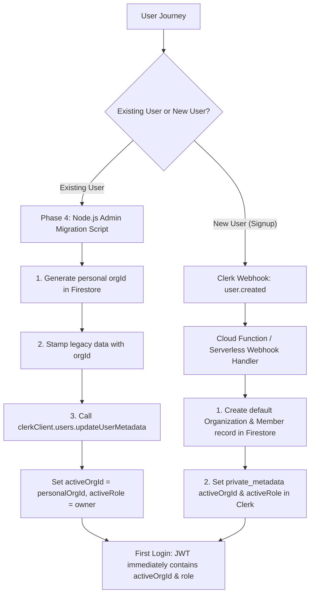
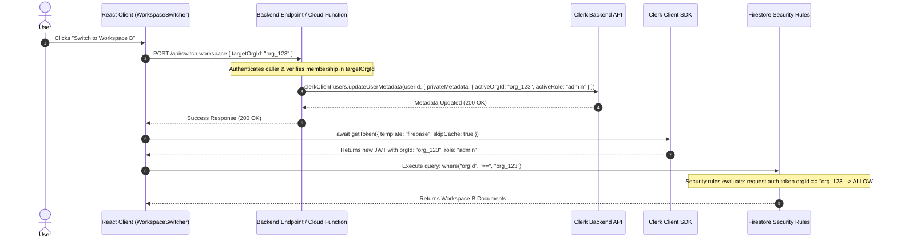

> ⚠️ **TARGET-STATE DOCUMENT — NOT CURRENT BEHAVIOR.**
> This document describes the planned B2B (multi-tenant) design. It does not describe what the code does today, and it uses `orgId` / `organization` vocabulary while the code uses `workspace`.
> **Known divergence:** The token endpoint mints Firebase custom tokens with `uid` only. `orgId` / `role` claims from the Clerk template are not forwarded to Firebase and are not used by the app or the rules.
> For current behavior see [CURRENT_STATE.md](./CURRENT_STATE.md). For the doc map see [INDEX.md](./INDEX.md). Do not implement from this document without explicit phase approval.
> Last reviewed against code: 2026-10-06

---

# Clerk JWT Template & Custom Claims Setup Guide (Phase 1)
## Multi-Tenant B2B Identity Architecture for Invoice Dashboard

---

## 🎯 Executive Overview
This guide defines the complete, step-by-step setup for **Clerk Authentication Custom Claims integration with Firebase Firestore Security Rules**.

By passing `orgId` and `role` as claims directly inside the signed JWT from Clerk, Firestore evaluates multi-tenant security rules with **zero database reads ($O(1)$ complexity)**.

---

## 🛠️ 1. JWT Template Configuration (Clerk Dashboard)

### 1.1 Step-by-Step Dashboard Setup
1. Log in to the [Clerk Dashboard](https://dashboard.clerk.com/).
2. Select your application (**Invomora** / **Invoice Dashboard**).
3. In the left navigation sidebar, navigate to **Configure** $\rightarrow$ **JWT Templates**.
4. Click **New template** $\rightarrow$ select the **Firebase** preset (or choose **Blank**).
5. Set the **Template Name** to: `firebase` *(Exact match required by the client SDK)*.
6. Set the **Token Lifetime (TTL)** to: `3600` seconds (1 hour).
7. Paste the JSON claims definition below into the **Claims** editor.
8. Click **Save Changes** (or **Apply changes**).

---

### 1.2 Exact JSON Body for the `"firebase"` Template

```json
{
  "orgId": "{{user.private_metadata.activeOrgId}}",
  "role": "{{user.private_metadata.activeRole}}"
}
```

> [!NOTE]
> When using the Clerk Firebase template preset, Clerk automatically merges standard Firebase Auth fields (`user_id`, `sub`, `aud`, `iss`) with the custom `orgId` and `role` claims.

---

### 1.3 Why `private_metadata` over `public_metadata`?

| Feature | `public_metadata` | `private_metadata` (Selected) | Security Impact |
| :--- | :--- | :--- | :--- |
| **Client Read Access** | Yes (Accessible via `user.publicMetadata`) | No (Hidden from client bundle) | Prevents leaking sensitive org configuration |
| **Client Write Access** | **Restricted by default**, but can be vulnerable if misconfigured | **Strictly Server-Only** | **Zero Client Tampering:** A malicious actor cannot modify their `role` to `"owner"` or change `activeOrgId` via the browser console or React state. |
| **JWT Interpolation** | Supported (`{{user.public_metadata.*}}`) | Supported (`{{user.private_metadata.*}}`) | Full claim interpolation supported in Clerk templates |
| **Plan Availability** | Available on all tiers | **100% Free on all Clerk plans** (up to 8KB metadata limit per user) | No paid upgrade required for backend metadata writes |

---

## 🚀 2. Bootstrap Flow: Who Sets `activeOrgId` First?

Because `private_metadata` is strictly server-writable, an authenticated user must have their initial `activeOrgId` and `activeRole` seeded before their first Firestore query.



### 2.1 First-Time Login for Existing Users (Phase 4 Script)
* The Phase 4 Node.js Migration Script (`scripts/migrate-to-b2b.js`) creates a personal organization in Firestore for each existing user and immediately updates their Clerk record:
  ```javascript
  await clerkClient.users.updateUserMetadata(userId, {
    privateMetadata: {
      activeOrgId: personalOrgId,
      activeRole: "owner"
    }
  });
  ```
* When an existing user logs in after migration, their minted JWT instantly contains their default `orgId` and `role`.

### 2.2 First-Time Login for Brand New Users (Event-Driven Webhook)
* A Clerk Webhook listens to the `user.created` event.
* The webhook handler automatically provisions a default personal organization in Firestore and seeds `private_metadata.activeOrgId` + `private_metadata.activeRole = "owner"`.

### 2.3 Multiple Organization Priority & Unset Resolution Rule
* If a user belongs to multiple organizations upon login, `private_metadata.activeOrgId` retains the **last active organization** they worked in.
* **Server-Side Fallback for Unset `activeOrgId`:** If `activeOrgId` is unset or missing in `private_metadata`, the client cannot resolve it independently because the minted JWT will not yet contain the required `orgId` custom claim for Firestore access. In this scenario:
  1. The client invokes a secure backend resolution endpoint / Cloud Function (or the bootstrap migration flow).
  2. The server queries `organizationMembers` via Admin SDK for the user's primary organization (defaulting to the first org where `role === "owner"`).
  3. The server updates `user.private_metadata.activeOrgId` and `activeRole` in Clerk.
  4. The client then requests a fresh token via `getToken({ template: "firebase", skipCache: true })`, ensuring the subsequent Firestore requests succeed with valid claims.

---

## 🏢 3. Approach Evaluation: Custom Metadata vs Native Clerk Organizations

### Approach A: Custom Metadata (`private_metadata`) — Recommended for Current Stack
* **How it works:** Organizations and memberships live as documents in Firestore (`organizations`, `organizationMembers`). The active organization and role are stored in `user.private_metadata.activeOrgId` and updated via backend script / Cloud Function.
* **Plan Verification:** Confirmed that `updateUserMetadata` and `privateMetadata` are **100% supported on Clerk's Free (Hobby) Plan** with zero fees.
* **Pros:** 
  * 100% Free on all Clerk tiers.
  * Complete control over Firestore data models and custom member fields.
  * Zero third-party vendor lock-in for organization quotas.
* **Cons:** Requires a server endpoint / Cloud Function to update `private_metadata` on organization switch.

---

### Approach B: Clerk Organizations (Native Feature)
* **How it works:** Clerk handles the multi-tenant hierarchy natively in the Clerk Dashboard.
* **JWT Claim Syntax:**
  ```json
  {
    "orgId": "{{org.id}}",
    "role": "{{org.role}}"
  }
  ```
* **Pros:** 
  * Clerk provides native client-side `setActive({ organization: orgId })` which automatically issues a new token without custom backend endpoints.
* **Cons & Trade-offs:**
  * **Plan Quota:** Custom roles, permission matrix, and member quota expansion require a paid Clerk plan.
  * **Split Source of Truth:** Organization metadata lives in Clerk while domain data lives in Firestore.

---

## 🔑 4. Environment Variables Specification

Ensure your environment configuration files (`.env` and production deployment secrets) contain the following keys:

```env
# -------------------------------------------------------------
# 1. CLIENT-SIDE VARIABLES (Exposed in Vite Bundle - SAFE)
# -------------------------------------------------------------
VITE_CLERK_PUBLISHABLE_KEY=<your-clerk-publishable-key>

# Optional: Explicit JWT template identifier if customized
VITE_CLERK_JWT_TEMPLATE=firebase

# Firebase Client Configuration
VITE_FIREBASE_API_KEY=<your-firebase-api-key>
VITE_FIREBASE_AUTH_DOMAIN=<your-firebase-auth-domain>
VITE_FIREBASE_PROJECT_ID=<your-firebase-project-id>
VITE_FIREBASE_STORAGE_BUCKET=<your-firebase-storage-bucket>
VITE_FIREBASE_MESSAGING_SENDER_ID=<your-firebase-messaging-sender-id>
VITE_FIREBASE_APP_ID=<your-firebase-app-id>

# -------------------------------------------------------------
# 2. SERVER-SIDE ONLY (NEVER Expose to Client / Git)
# -------------------------------------------------------------
CLERK_SECRET_KEY=<your-clerk-secret-key>
GOOGLE_APPLICATION_CREDENTIALS=./serviceAccountKey.json
```

> [!CAUTION]
> Never prefix `CLERK_SECRET_KEY` with `VITE_`. It must only be used in Node.js server scripts (`scripts/`) or Firebase Cloud Functions.

---

## 🔄 5. Multi-Org Switching Flow & Token Lifecycle

### 5.1 Server-Side Metadata Mutation Flow
Because `private_metadata` can **only** be modified using the Clerk Backend SDK with `CLERK_SECRET_KEY`, organization switching follows this secure sequence:



### 5.2 Preventing Stale Tokens (Window Focus & Auth State Refresh)
To prevent the client from holding stale claims if metadata is updated in another tab or in the background:
1. **Force Uncached Refresh on Org Switch:** Always invoke `getToken({ template: "firebase", skipCache: true })` immediately upon switching workspaces.
2. **Window Focus Token Revalidation:** Attach a lightweight listener in `WorkspaceContext`:
   ```javascript
   useEffect(() => {
     const handleWindowFocus = async () => {
       const token = await session?.getToken({ template: "firebase", skipCache: true });
       // Compare decoded claims against active context orgId; trigger sync if mismatched
     };
     window.addEventListener("focus", handleWindowFocus);
     return () => window.removeEventListener("focus", handleWindowFocus);
   }, [session]);
   ```

---

## 🧪 6. Verification Steps: Inspecting Claims in Browser Console

To verify that your Clerk JWT template is correctly minting `orgId` and `role` claims:

### 6.1 Verification Snippet (Run in Browser Console)
Open Chrome DevTools / Console while logged into the app:

```javascript
(async () => {
  // 1. Get current Clerk session token for the firebase template
  const token = await window.Clerk?.session?.getToken({ template: "firebase", skipCache: true });
  
  if (!token) {
    console.error("❌ No token returned! Is the user logged in?");
    return;
  }
  
  // 2. Decode the JWT payload
  const payloadBase64 = token.split('.')[1];
  const decodedClaims = JSON.parse(atob(payloadBase64));
  
  console.log("🔍 Decoded Clerk-Firebase JWT Claims:", decodedClaims);
  
  // 3. Assert B2B Claims
  console.assert(decodedClaims.orgId !== undefined, "❌ 'orgId' claim is MISSING in JWT!");
  console.assert(decodedClaims.role !== undefined, "❌ 'role' claim is MISSING in JWT!");
  
  if (decodedClaims.orgId && decodedClaims.role) {
    console.log(`✅ SUCCESS! Active Org: ${decodedClaims.orgId} | Active Role: ${decodedClaims.role}`);
  }
})();
```

---

### 6.2 Troubleshooting Matrix

| Symptom | Root Cause | Fix |
| :--- | :--- | :--- |
| `orgId` or `role` claim is `null` / `undefined` | User's `private_metadata` has not been populated with `activeOrgId` | Run the Phase 4 Migration Script or populate metadata via Clerk Dashboard user editor. |
| `getToken({ template: "firebase" })` throws 404 error | Template name mismatch in Clerk Dashboard | Ensure the JWT Template Name is spelled exactly `firebase` (all lowercase, no spaces). |
| Token still contains old `orgId` after switching | Client browser is reading cached JWT | Pass `{ skipCache: true }` to `getToken({ template: "firebase", skipCache: true })`. |
| Firebase throws `PERMISSION_DENIED` | Firestore Security Rules evaluating non-matching `orgId` | Confirm `where("orgId", "==", activeOrgId)` matches `decodedClaims.orgId`. |

---

## ⚠️ 7. Known Limitations & Risks

1. **Token Refresh Latency:** Calling `getToken({ skipCache: true })` makes a network roundtrip to Clerk's edge authentication servers (typically 80ms–180ms). The UI must show a brief loading state on the Workspace Switcher during the transition.
2. **Metadata Propagation Delay:** When updating `private_metadata` via the Backend API, wait for the API promise to resolve before executing `getToken({ skipCache: true })` on the client.
3. **Clerk Free Tier Quotas:** Confirmed metadata updates and JWT templates are **100% free**; batch scripts should respect standard rate limits ($\le 10$ requests/sec).

---

## 📋 8. Phase 1 Completion Checklist
- [ ] JWT template named `"firebase"` created in Clerk Dashboard.
- [ ] Claims JSON configured with `orgId` and `role`.
- [ ] Test user's `private_metadata` populated with valid `activeOrgId` and `activeRole`.
- [ ] Browser console verification snippet returns `✅ SUCCESS` with valid `orgId` and `role`.
- [ ] Window focus token synchronization listener documented and ready for `WorkspaceContext` implementation.
