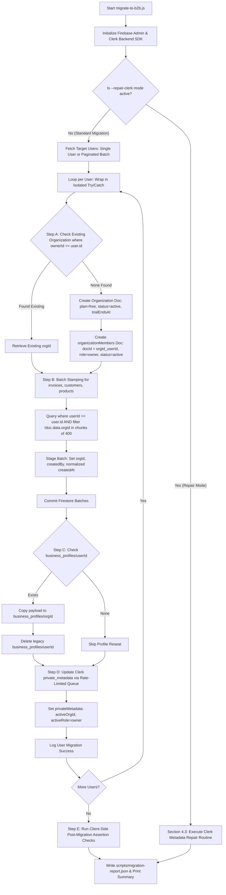

> ⚠️ **TARGET-STATE DOCUMENT — NOT CURRENT BEHAVIOR.**
> This document describes the planned B2B (multi-tenant) design. It does not describe what the code does today, and it uses `orgId` / `organization` vocabulary while the code uses `workspace`.
> **Known divergence:** The script is implemented in `scripts/migrate-to-b2b.js`, but live execution is strictly deferred to Phase 4 after Phase 1 tenancy decisions.
> For current behavior see [../CURRENT_STATE.md](../CURRENT_STATE.md). For the doc map see [../INDEX.md](../INDEX.md). Do not run or implement from this document without explicit phase approval.
> Last reviewed against code: 2026-10-10


---

# Phase 4 Implementation Plan: Node.js B2B Migration Script (`scripts/migrate-to-b2b.js`)

---

## 🎯 Executive Overview
This document specifies the architecture, execution pipeline, safety controls, and pseudo-code for the **Phase 4 Migration Script**.

The script migrates historical single-user records into the multi-tenant model using the **Firebase Admin SDK** and **Clerk Backend SDK**.

---

## 📂 1. File Layout & Environment Configuration

### 1.1 Directory Structure
```
d:\invoice-dashboard\
├── scripts/
│   ├── migrate-to-b2b.js         # Main migration runner & CLI interface
│   ├── migrate-helpers.js        # Batch commit, rate-limiter, retry & logging helpers
│   └── migration-report.json     # Auto-generated run summary & audit trail (gitignored)
├── serviceAccountKey.json        # Google Service Account Credentials (gitignored)
└── .gitignore                    # Updated with security exemptions
```

### 1.2 `.gitignore` Security Additions
```gitignore
# Firebase Service Account & Migration Artifacts
serviceAccountKey.json
scripts/migration-report.json
```

### 1.3 Required Environment Variables
* `GOOGLE_APPLICATION_CREDENTIALS` (Absolute/relative path to `serviceAccountKey.json`)
* `CLERK_SECRET_KEY` (Clerk Production or Staging Secret Key starting with `sk_live_` or `sk_test_`)

---

## 💻 2. CLI Interface & Operational Flags

The script defaults to **Dry-Run Mode** for safety. Writing to Firestore and Clerk requires explicit flag opt-in.

| CLI Flag | Type | Default | Purpose |
| :--- | :--- | :--- | :--- |
| `--dry-run` | `boolean` | `true` | Runs full query pipeline, calculates mutation counts, but skips DB/Clerk writes. |
| `--execute` | `boolean` | `false` | Disables dry-run and executes live batch mutations. |
| `--repair-clerk` | `boolean` | `false` | **Standalone Clerk Recovery Mode**: Reads Firestore for existing user organizations and only re-applies `private_metadata` updates. Zero Firestore writes. |
| `--user=<id>` | `string` | `null` | Runs migration for a single designated Clerk User ID (ideal for test verification). |
| `--limit=<n>` | `number` | `null` | Limits maximum number of users processed in a single run. |
| `--verbose` | `boolean` | `false` | Enables line-by-line document mutation logging. |

#### CLI Invocation Examples:
```bash
# 1. Safety Dry-run on entire userbase (zero writes)
node scripts/migrate-to-b2b.js

# 2. Targeted test on a single test user in dry-run
node scripts/migrate-to-b2b.js --user=user_2tABC12345

# 3. Live execution for a single user
node scripts/migrate-to-b2b.js --user=user_2tABC12345 --execute

# 4. Full production migration execution
node scripts/migrate-to-b2b.js --execute

# 5. Standalone Clerk Metadata Repair Mode (Zero Firestore writes)
node scripts/migrate-to-b2b.js --repair-clerk
```

---

## 🔄 3. Migration Pipeline (Step-by-Step Architecture)



---

## 📝 4. Pseudo-Code & Query Implementation Patterns

### 4.1 Initialization & Rate Limiter (`scripts/migrate-helpers.js`)

```javascript
import admin from "firebase-admin";
import { createClerkClient } from "@clerk/backend";

// Initialize Firebase Admin
if (!admin.apps.length) {
  admin.initializeApp({
    credential: admin.credential.applicationDefault()
  });
}
export const db = admin.firestore();

// Initialize Clerk Backend Client
export const clerk = createClerkClient({
  secretKey: process.env.CLERK_SECRET_KEY
});

// Rate-limited Clerk API caller (Max 10 requests / second)
export async function rateLimitedClerkUpdate(userId, privateMetadata) {
  await new Promise((resolve) => setTimeout(resolve, 110)); // 110ms delay enforces < 10 req/s
  return clerk.users.updateUserMetadata(userId, {
    privateMetadata
  });
}

// Exponential Backoff Retry Utility for Transient Network Failures
export async function withRetry(fn, maxRetries = 3, delay = 500) {
  for (let attempt = 1; attempt <= maxRetries; attempt++) {
    try {
      return await fn();
    } catch (err) {
      if (attempt === maxRetries) throw err;
      await new Promise((res) => setTimeout(res, delay * Math.pow(2, attempt - 1)));
    }
  }
}
```

---

### 4.2 Main Migration Loop (`scripts/migrate-to-b2b.js`)

```javascript
import { db, clerk, rateLimitedClerkUpdate, withRetry } from "./migrate-helpers.js";
import { runClerkRepair } from "./migrate-repair.js";
import fs from "fs";

async function runMigration() {
  const isRepairClerk = process.argv.includes("--repair-clerk");
  const isExecute = process.argv.includes("--execute");
  const isDryRun = !isExecute || process.argv.includes("--dry-run");
  const userArg = process.argv.find((a) => a.startsWith("--user="))?.split("=")[1];

  // Route to Clerk Repair Mode if requested
  if (isRepairClerk) {
    return await runClerkRepair({ userArg, isDryRun });
  }

  console.log(`🚀 Starting B2B Migration Script [Mode: ${isDryRun ? "DRY-RUN" : "LIVE EXECUTE"}]`);

  const report = {
    startTime: new Date().toISOString(),
    isDryRun,
    usersProcessed: 0,
    organizationsCreated: 0,
    membersCreated: 0,
    documentsStamped: { invoices: 0, customers: 0, products: 0 },
    profilesReseated: 0,
    errors: []
  };

  // 1. Fetch Target Users
  let users = [];
  if (userArg) {
    const singleUser = await clerk.users.getUser(userArg);
    users = [singleUser];
  } else {
    // Paginate all Clerk users in batches of 100
    let offset = 0;
    while (true) {
      const batch = await clerk.users.getUserList({ limit: 100, offset });
      if (!batch || batch.length === 0) break;
      users.push(...batch);
      offset += 100;
    }
  }

  // 2. Process Each User
  for (const user of users) {
    const userId = user.id;
    const userLabel = user.firstName ? `${user.firstName} ${user.lastName || ""}`.trim() : user.emailAddresses?.[0]?.emailAddress || userId;

    try {
      console.log(`\n👤 Processing User: ${userLabel} (${userId})`);
      report.usersProcessed++;

      // Step A: Idempotent Organization Provisioning
      const orgQuery = await db.collection("organizations").where("ownerId", "==", userId).limit(1).get();
      let orgId;

      if (!orgQuery.empty) {
        orgId = orgQuery.docs[0].id;
        console.log(`  ℹ️ Organization already exists: ${orgId}`);
      } else {
        const orgName = `${user.firstName ? user.firstName + "'s" : "My"} Business`;
        const now = admin.firestore.FieldValue.serverTimestamp();
        const trialEnd = new Date(Date.now() + 14 * 24 * 60 * 60 * 1000); // 14-day trial

        if (!isDryRun) {
          const orgRef = await db.collection("organizations").add({
            name: orgName,
            ownerId: userId,
            plan: "free",
            status: "active",
            trialEndsAt: admin.firestore.Timestamp.fromDate(trialEnd),
            createdAt: now,
            updatedAt: now
          });
          orgId = orgRef.id;

          // Create organizationMembers doc
          const memberDocId = `${orgId}_${userId}`;
          await db.collection("organizationMembers").doc(memberDocId).set({
            orgId,
            userId,
            email: user.emailAddresses?.[0]?.emailAddress?.toLowerCase() || "",
            displayName: userLabel,
            role: "owner",
            status: "active",
            joinedAt: now,
            updatedAt: now
          });
        } else {
          orgId = `dry_run_org_${userId.slice(-6)}`;
        }
        report.organizationsCreated++;
        report.membersCreated++;
        console.log(`  ✅ Created Organization & Owner Member: ${orgId}`);
      }

      // Step B: Batch Stamp Domain Collections (invoices, customers, products)
      for (const collName of ["invoices", "customers", "products"]) {
        const snap = await db.collection(collName).where("userId", "==", userId).get();
        // Client-side filtering ensures documents without an orgId field are caught accurately
        const unmigratedDocs = snap.docs.filter((d) => !d.data().orgId);

        if (unmigratedDocs.length > 0) {
          console.log(`  📦 Stamping ${unmigratedDocs.length} ${collName}...`);
          
          if (!isDryRun) {
            // Commit in chunks of 400 to respect Firestore batch limit of 500
            for (let i = 0; i < unmigratedDocs.length; i += 400) {
              const chunk = unmigratedDocs.slice(i, i + 400);
              const batch = db.batch();

              chunk.forEach((docSnap) => {
                const data = docSnap.data();
                const updatePayload = {
                  orgId: orgId,
                  createdBy: userId,
                  createdAt: data.createdAt || data.created_at || admin.firestore.FieldValue.serverTimestamp()
                };

                // Step B.5: Convert legacy snake_case fields & string dates to camelCase Timestamps
                if (collName === "customers") {
                  if (data.full_name) updatePayload.name = data.full_name;
                  if (data.phone_number) updatePayload.phone = data.phone_number;
                } else if (collName === "invoices") {
                  if (data.invoice_no) updatePayload.invoiceNumber = data.invoice_no;
                  if (data.tax_percentage !== undefined) updatePayload.taxRate = data.tax_percentage;
                  if (data.total_price !== undefined) updatePayload.totalAmount = data.total_price;
                  if (data.payment_type !== undefined) updatePayload.paymentType = data.payment_type;
                  if (typeof data.invoice_date === "string" || typeof data.invoiceDate === "string") {
                    const dStr = data.invoice_date || data.invoiceDate;
                    updatePayload.invoiceDate = admin.firestore.Timestamp.fromDate(new Date(dStr + "T00:00:00.000Z"));
                  }
                  if (typeof data.due_date === "string" || typeof data.dueDate === "string") {
                    const dStr = data.due_date || data.dueDate;
                    updatePayload.dueDate = admin.firestore.Timestamp.fromDate(new Date(dStr + "T00:00:00.000Z"));
                  }
                  if (typeof data.paid_date === "string" || typeof data.paidDate === "string") {
                    const dStr = data.paid_date || data.paidDate;
                    updatePayload.paidDate = admin.firestore.Timestamp.fromDate(new Date(dStr + "T00:00:00.000Z"));
                  }
                }

                batch.update(docSnap.ref, updatePayload);
              });

              await batch.commit();
            }
          }
          report.documentsStamped[collName] += unmigratedDocs.length;
        }
      }

      // Step C: Reseat Business Profile
      const legacyProfileRef = db.collection("business_profiles").doc(userId);
      const legacyProfileSnap = await legacyProfileRef.get();

      if (legacyProfileSnap.exists) {
        console.log(`  🏢 Reseating business profile: ${userId} -> ${orgId}`);
        if (!isDryRun) {
          const profileData = legacyProfileSnap.data();
          const reseatedProfile = {
            ...profileData,
            orgId: orgId,
            userId: userId,
            createdBy: userId,
            updatedAt: admin.firestore.FieldValue.serverTimestamp()
          };
          if (profileData.account_number) reseatedProfile.accountNumber = profileData.account_number;
          if (profileData.ifsc_code) reseatedProfile.ifscCode = profileData.ifsc_code;
          if (profileData.bank_name) reseatedProfile.bankName = profileData.bank_name;
          if (profileData.tax_id) reseatedProfile.taxId = profileData.tax_id;

          await db.collection("business_profiles").doc(orgId).set(reseatedProfile);
          // Verify copy exists before deletion
          const verifySnap = await db.collection("business_profiles").doc(orgId).get();
          if (verifySnap.exists) {
            await legacyProfileRef.delete();
          }
        }
        report.profilesReseated++;
      }

      // Step D: Update Clerk Private Metadata
      if (!isDryRun) {
        await withRetry(() =>
          rateLimitedClerkUpdate(userId, {
            activeOrgId: orgId,
            activeRole: "owner"
          })
        );
        console.log(`  🔐 Updated Clerk private_metadata: activeOrgId=${orgId}, activeRole=owner`);
      }

    } catch (err) {
      console.error(`  ❌ Failed migrating user ${userId}:`, err.message);
      report.errors.push({ userId, error: err.message });
    }
  }

  // 3. Post-Migration Assertion Checks (Option B: Full Collection Client-Side Validation)
  if (!isDryRun) {
    console.log(`\n🔍 Running Post-Migration Assertion Checks (Zero-Missing Field Validation)...`);
    for (const collName of ["invoices", "customers", "products"]) {
      const fullSnapshot = await db.collection(collName).get();
      const unscopedDocs = fullSnapshot.docs.filter((docSnap) => {
        const data = docSnap.data();
        return !data.orgId || data.orgId === "";
      });
      console.log(`  - ${collName} total docs: ${fullSnapshot.size} | Unscoped remaining: ${unscopedDocs.length}`);
      console.assert(unscopedDocs.length === 0, `❌ CRITICAL: ${unscopedDocs.length} ${collName} are still missing orgId!`);
    }

    // Verify all business_profiles docIds are organization IDs
    const profilesSnapshot = await db.collection("business_profiles").get();
    const legacyDocIds = profilesSnapshot.docs.filter((d) => d.id.startsWith("user_"));
    console.log(`  - business_profiles total docs: ${profilesSnapshot.size} | Legacy user_* docIds: ${legacyDocIds.length}`);
    console.assert(legacyDocIds.length === 0, `❌ CRITICAL: ${legacyDocIds.length} legacy user-keyed business profiles remain!`);
  }

  // 4. Save Migration Report
  report.endTime = new Date().toISOString();
  fs.writeFileSync("scripts/migration-report.json", JSON.stringify(report, null, 2));
  console.log(`\n📊 Migration Report saved to scripts/migration-report.json`);
}

runMigration().catch(console.error);
```

---

### 4.3 Standalone Clerk Recovery Mode (`--repair-clerk`)

This routine runs strictly to fix Clerk `private_metadata` in the event of API transient limits without making any mutations to Firestore:

```javascript
export async function runClerkRepair({ userArg, isDryRun }) {
  console.log(`\n🔧 Running Standalone Clerk Metadata Repair Mode [Dry-Run: ${isDryRun}]`);
  
  const orgsSnapshot = await db.collection("organizations").get();
  console.log(`📦 Found ${orgsSnapshot.size} total organizations in Firestore`);

  let repairedCount = 0;
  const errors = [];

  for (const orgDoc of orgsSnapshot.docs) {
    const orgData = orgDoc.data();
    const orgId = orgDoc.id;
    const ownerId = orgData.ownerId;

    if (!ownerId) continue;
    if (userArg && ownerId !== userArg) continue;

    try {
      console.log(`  🔄 Repairing metadata for User ${ownerId} -> Org: ${orgId}`);
      if (!isDryRun) {
        await withRetry(() =>
          rateLimitedClerkUpdate(ownerId, {
            activeOrgId: orgId,
            activeRole: "owner"
          })
        );
      }
      repairedCount++;
    } catch (err) {
      console.error(`  ❌ Failed repairing Clerk metadata for ${ownerId}:`, err.message);
      errors.push({ ownerId, error: err.message });
    }
  }

  console.log(`\n✅ Clerk Metadata Repair Complete: ${repairedCount} users processed, ${errors.length} errors.`);
}
```

---

## 🛡️ 5. Safety, Idempotency & Rollback Guarantees

1. **Accurate Missing-Field Verification:** Replaced equality queries on missing fields with full-collection client-side filtering (`!doc.data().orgId`), ensuring 100% detection of unmigrated documents.
2. **Dual-Key Retention:** `userId` is strictly preserved on every invoice, customer, and product. If a rollback is ever needed, client code can revert to `where("userId", "==", userId)` instantly.
3. **Atomic Profile Reseats:** `business_profiles/${userId}` is only deleted AFTER `business_profiles/${orgId}` has been created and verified via `get()`.
4. **Idempotent Re-runs:** Re-running against an already-migrated database finds 0 unmigrated documents and creates 0 duplicate organizations.
5. **Decoupled Clerk Recovery:** The `--repair-clerk` mode ensures Clerk state can be synchronized independently without risking accidental Firestore write cycles.

---

## 🚦 6. Phase 4 Execution Checklist
- [ ] `serviceAccountKey.json` downloaded from Firebase Console and added to root.
- [ ] `.gitignore` verified to exclude credentials and migration reports.
- [ ] Run `--dry-run` and review `migration-report.json` mutation counts.
- [ ] Run `--user=<test-user-id> --execute` and verify browser claims.
- [ ] Execute full production migration: `node scripts/migrate-to-b2b.js --execute`.
- [ ] Confirm post-migration assertion checks return 0 unscoped records.
- [ ] (If needed) Run `node scripts/migrate-to-b2b.js --repair-clerk --execute` to fix any failed Clerk metadata syncs.
